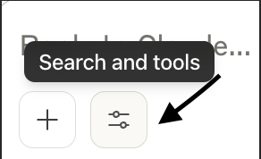
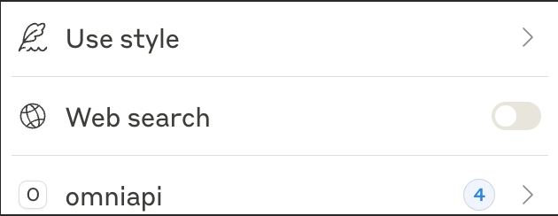

# OmniAPI MCP Server

Add REST APIs with a prompt and start testing endpoints instantly.

## Prerequisites

- **Node.js**: Download and install from [https://nodejs.org/](https://nodejs.org/)
- **Git**: Download and install [https://git-scm.com/downloads](https://git-scm.com/downloads)
- **Claude Desktop**: Download and install [https://claude.ai/download](https://claude.ai/download)

## Installation

### 1. Clone the Repository

```bash
git clone https://github.com/EvertonColombo/omniapi-mcp.git
```

### 2. Navigate to Directory

```bash
cd omniapi-mcp
```

### 3. Install Dependencies

```bash
npm install
```

### 4. Configure Claude Desktop

1. Open Claude Desktop settings
2. Go to **Developer** section
3. Edit the `claude_desktop_config.json

### 5. Restart Claude and Verify Installation

1. Go to **Search and Tools** in Claude Desktop



2. You should see **omniapi** listed in available tools



## How to Use

### Quick Start Example

1. **Add an API:**

   👤 **You:** "Add the arXiv API"

   🤖 **Claude:** [Automatically uses the `add_api` tool]
   - name: "arxiv"
   - baseUrl: "http://export.arxiv.org/api"

   ✅ API "arxiv" added successfully!

2. **Done! You can now use it immediately**

## Available Tools

### 🔧 add_api
Adds a new API. You only need the name and base URL!
- `name`: Identifier for the API
- `baseUrl`: Base URL (e.g., https://api.example.com)
- `headers`: Optional headers (e.g., Authorization)

### 📋 list_apis
Lists all configured APIs.

### 🌐 call_api
Makes requests to any configured API.
- `api`: Name of the API
- `endpoint`: Endpoint (e.g., /users, /posts/1)
- `method`: GET, POST, PUT, DELETE, PATCH
- `body`: Data to send
- `params`: Query parameters

### 🔍 discover_api
Attempts to automatically discover endpoints.

---

*Made with vibe-coding* 🎯
